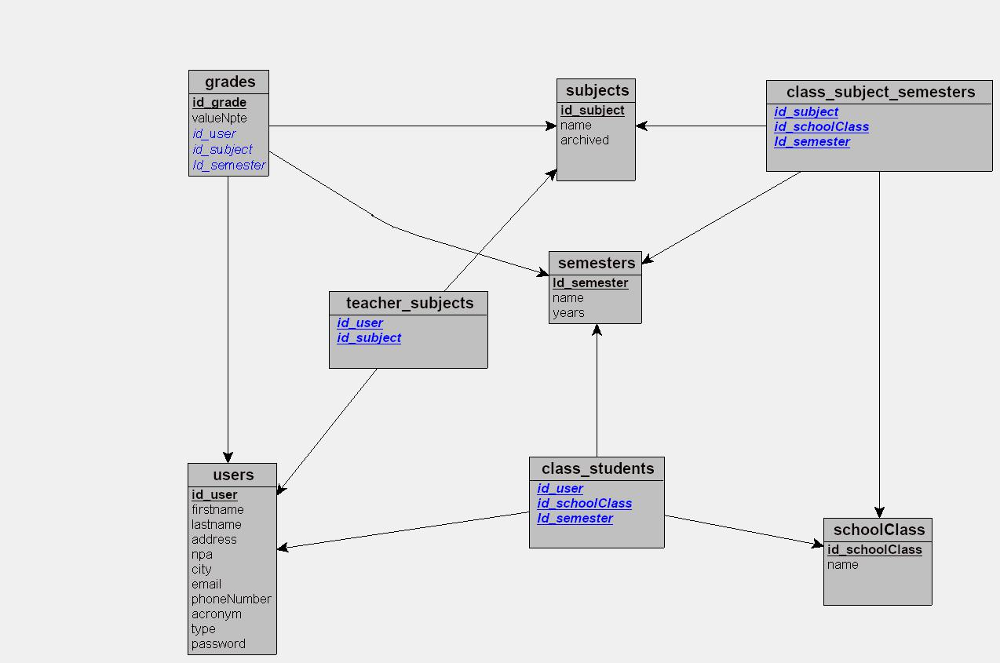

# ROR : Application de Gestion Scolaire

Cette application de gestion scolaire permet de gérer les élèves, les classes, les semestres, les matières et les notes des élèves pour chaque matière et semestre.

## Installation

1. Assurez-vous d'avoir Ruby installé sur votre système. Vous pouvez le télécharger depuis [https://www.ruby-lang.org/](https://www.ruby-lang.org/).

2. Clonez ce dépôt sur votre machine locale :

    ```bash
    git clone https://github.com/votre-utilisateur/votre-projet.git ROR-Yannick
    ```

3. Accédez au répertoire de l'application :

    ```bash
    cd ROR-Yannick
    ```

4. Installez les dépendances en exécutant la commande suivante :

    ```bash
    bundle install
    ```
ou si vous avez des problèmes avec les droits d'accès :
  ```bash
    sudo bundle install
  ```

5. Créez la base de données et exécutez les migrations :

    ```bash
    rails db:create
    rails db:migrate
    ```

6. (Facultatif) Vous pouvez également exécuter les graines pour créer des données d'exemple :

    ```bash
    rails db:seed
    ```

## Utilisation

### Création d'un Élève

1. Connectez-vous à l'application en utilisant vos informations d'identification.

2. Accédez à la section "Student" dans le menu principal.

3. Cliquez sur le bouton "New Student".

4. Remplissez les informations requises telles que le Firstname, Lastname, e-mail, etc.

5. Cliquez sur le bouton "Create student" pour enregistrer l'élève.

### Création d'une Classe

1. Accédez à la section "School Class" dans le menu principal.

2. Cliquez sur le bouton "new School Class".

3. Entrez les détails de la classe tels que le name

4. Cliquez sur le bouton "Create school Class" pour enregistrer la classe.

### Création d'un Semestre

1. Accédez à la section "Semesters" dans le menu principal.

2. Cliquez sur le bouton "New Semester".

3. Saisissez les détails du semestre tels que le name, year, etc.

4. Cliquez sur le bouton "Create Semester" pour enregistrer le semestre.

### Ajout de Matières

1. Accédez à la section "Subjects" dans le menu principal.

2. Cliquez sur le bouton "New Subjects".

3. Entrez les détails de la matière tels que le name, etc.

4. Cliquez sur le bouton "Create Subjects" pour enregistrer la matière.

### Attribution de Notes à un Élève

1. Accédez à la section "Élèves" dans le menu principal.

2. Sélectionnez l'élève auquel vous souhaitez attribuer des notes.

3. Vous verrez une liste des matières et des semestres disponibles pour cet élève.

4. Cliquez sur le bouton "Ajouter Note" à côté de la matière et du semestre appropriés.

5. Saisissez la note pour cet élève dans le formulaire qui apparaît.

6. Cliquez sur le bouton "Enregistrer" pour attribuer la note à l'élève.

---

## Modèle Conceptuel de Données (MCD) avec Formes Normales

Le Modèle Conceptuel de Données (MCD) est une représentation visuelle des entités, des attributs et des relations entre les données dans un système. Les formes normales sont des règles de conception de base de données qui garantissent la cohérence et la normalisation des données pour éviter les anomalies et les redondances.

### MLD Schema :


### Entités Principales :

1. **Users (Utilisateur) :** Représente les utilisateurs du système, y compris les élèves, les professeurs et les superviseurs. Cette entité contient des informations telles que le prénom, le nom, l'e-mail et le type d'utilisateur.

2. **Subjects (Matière) :** Représente les matières enseignées dans le système. Chaque matière a un nom et peut être enseignée par plusieurs professeurs.

3. **Grades (Note) :** Représente les notes attribuées aux élèves pour une matière donnée. Chaque note est associée à un élève, une matière, un semestre et une valeur de note.

4. **Semesters (Semestre) :** Représente les différents semestres académiques dans lesquels les notes sont attribuées. Chaque semestre a une année et peut être associé à plusieurs matières.

5. **SchoolClasses (Classe Scolaire) :** Représente les différentes classes dans l'école. Chaque classe a un nom unique.

6. **ClassStudents (Élève de la Classe) :** Associe les élèves aux classes et aux semestres, permettant de suivre quels élèves sont dans quelles classes à chaque semestre.

7. **ClassSubjectSemesters (Classe-Matière-Semestre) :** Cette table d'association lie les classes, les matières et les semestres, indiquant quelle matière est enseignée dans quelle classe à chaque semestre.

8. **TeacherSubjects (Enseignant-Matière) :** Relie les enseignants aux matières qu'ils enseignent.

### Relations :

1. **Users (Utilisateurs) - Grades (1:N) :** Un utilisateur (en tant qu'élève) peut avoir plusieurs notes (Grades), mais chaque note est unique à un seul utilisateur.

2. **Users (Utilisateurs) - TeacherSubjects (1:N) :** Un utilisateur (en tant qu'enseignant) peut enseigner plusieurs matières (Subjects), représenté par la relation dans TeacherSubjects.

3. **Subjects (Matières) - Grades (1:N) :** Une matière peut être associée à plusieurs notes, mais chaque note concerne une seule matière.

4. **Subjects (Matières) - ClassSubjectSemesters (1:N) :** Une matière peut être enseignée dans plusieurs classes à différents semestres, comme indiqué dans ClassSubjectSemesters.

5. **Semesters (Semestres) - Grades (1:N) :** Un semestre peut contenir plusieurs notes, avec chaque note attribuée dans le cadre d'un semestre spécifique.

6. **Semesters (Semestres) - ClassSubjectSemesters (1:N) :** Un semestre peut inclure plusieurs associations de classes et matières, représentées dans ClassSubjectSemesters.

7. **SchoolClasses (Classes) - ClassStudents (1:N) :** Une classe peut comprendre plusieurs élèves, comme illustré par les associations dans ClassStudents.

8. **SchoolClasses (Classes) - ClassSubjectSemesters (1:N) :** Une classe peut être liée à plusieurs associations de matières et semestres dans ClassSubjectSemesters.

9. **ClassStudents (Élèves de la Classe) - Users (N:1) :** Plusieurs entrées dans ClassStudents peuvent se référer à un seul élève (User).

10. **ClassSubjectSemesters - Subjects, SchoolClasses, Semesters (N:1) :** Chaque entrée dans ClassSubjectSemesters est associée à une unique matière, classe et semestre.

11. **TeacherSubjects - Users, Subjects (N:1) :** Chaque association dans TeacherSubjects réfère à un unique enseignant (User) et une unique matière (Subject).

### Formes Normales :

Les formes normales sont des règles de conception qui garantissent l'organisation efficace et la normalisation des données. Voici comment le MCD satisfait les formes normales :

- **1NF (Première Forme Normale) :** Toutes les valeurs dans les tables sont atomiques, c'est-à-dire qu'elles ne sont pas subdivisées en parties plus petites.

- **2NF (Deuxième Forme Normale) :** Toutes les dépendances fonctionnelles sont résolues, et chaque attribut non clé est entièrement fonctionnellement dépendant de la clé primaire.

- **3NF (Troisième Forme Normale) :** Il n'y a pas de dépendance transitive entre les attributs non clés, et chaque attribut non clé est directement dépendant de la clé primaire.

---

## Procédure pour la Création des Modèles de Données (Scaffold)

Vous pouvez utiliser les commandes de génération de rails pour créer rapidement les modèles de données nécessaires à votre application. Voici les commandes pour générer chaque modèle :

```bash
rails generate scaffold User type:string lastname:string firstname:string email:string password_digest:string address:string phone:string npa:integer city:string country:string, state:string
rails generate scaffold SchoolClass name:string
rails generate scaffold Subject name:string archived:boolean
rails generate scaffold Grade value:float student:references subject:references semester:references
rails generate scaffold Semester name:string year:integer
rails

 generate scaffold ClassStudent student:references school_class:references semester:references
rails generate scaffold TeacherSubject teacher:references subject:references
rails generate scaffold ClassSubjectSemester school_class:references subject:references semester:references
```